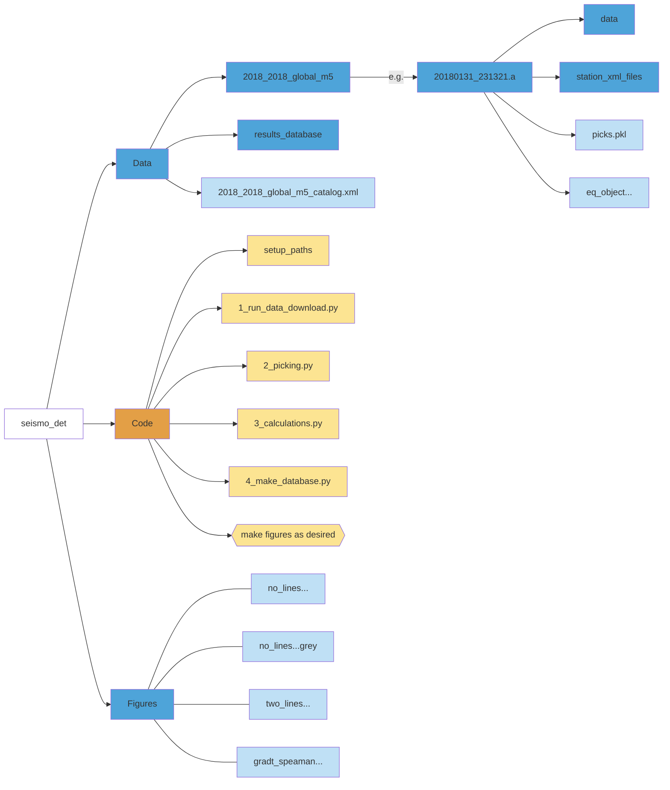

# seismo_det
Determinism by looking at seismogram attributes

# Overview

# Table of Contents

- [seismo\_det](#seismo_det)
- [Overview](#overview)
- [Table of Contents](#table-of-contents)
- [Installation](#installation)
- [Structure](#structure)
- [Use for your own data](#use-for-your-own-data)
- [Example data](#example-data)

# Installation

1. Clone this repository

    git clone git@github.com:RebeccaColquhoun/seismo_det.git

2. Open environment.yml and choose the name for your virtual environment
3. Create a virtual environment with all required Python packages by running the following command in terminal
    conda env create -f environment.yml

# Structure

Code is provided to download data, pick waveforms and calculate the 4 parameters of interest. It then extracts relevant parameters into DataFrames which can be used for further analysis, plotting etc.

# Use for your own data
1. Set your desired filepaths for storage in setup_paths.py. Otherwise default values will be used.
2. In 1_run_data_download.py set values for min_mag, min_year and max_year. To download just one year of data set min_year and max_year to be the same.
3. Run 1_run_data_download.py
4. Run 2_picking.py
5. Run 3_calculations.py
    a. Calculations automatically run on 1 thread. If you want to use multithreading, set num_threads in setup_paths.py to a non-1 value.
6. Run 4_make_database.py
7. To make figures similar to those in the paper, run figures_2_3.py and figures_4_5.py.

# Example data
A small section of example data has been provided in the data/ subdirectory
